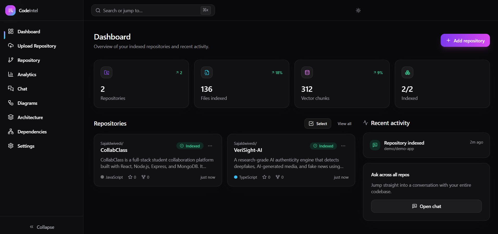
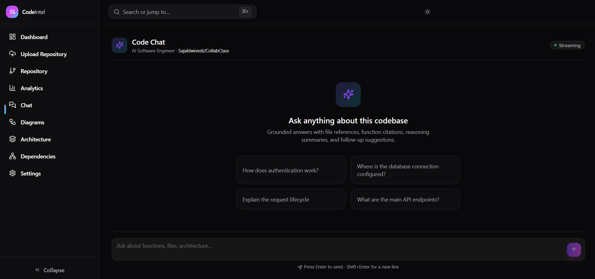
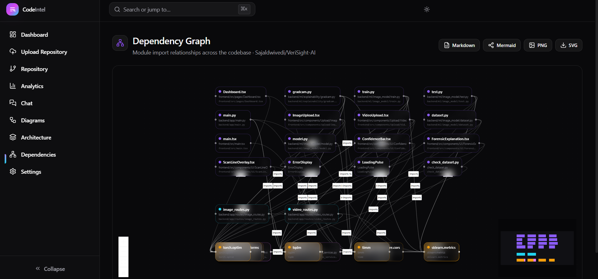
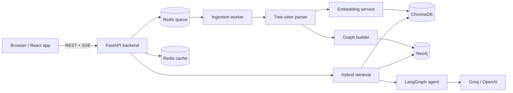

# CodeIntel

CodeIntel indexes a GitHub repository and lets you ask questions about it in plain English — "how does auth work?", "trace the login request", "which files handle payments?" — and answers with real citations back to the source. It pairs vector search over semantic code chunks with a Neo4j knowledge graph, so answers understand both *what* the code says and *how* it's wired together.

It's built for developers who join an unfamiliar codebase, review large PRs, or maintain projects big enough that grepping stops being useful. Instead of reading a hundred files to understand one flow, you ask a question and get a grounded answer with the exact functions, files, and line ranges it came from.

---

## Features

### Repository understanding
- Clone any public GitHub repo or upload a project archive.
- Tree-sitter parsing extracts functions, classes, methods, imports, and API endpoints.
- Incremental, job-based ingestion with live progress over Server-Sent Events.

### Code intelligence
- A LangGraph agent with seven tools: code search, graph search, dependency analysis, architecture generation, function explanation, request-flow tracing, and bug-pattern detection.
- Answers are grounded in retrieved code and cite file paths, symbols, and line numbers.
- Streaming responses with suggested follow-up questions.

### Graph RAG
- Hybrid retrieval merges semantic vector hits (ChromaDB) with structural results from a Neo4j graph.
- The graph models call chains, imports, and symbol relationships, so questions like "what calls this function?" resolve against real edges rather than fuzzy text matches.

### Architecture analysis
- Auto-generated architecture and dependency diagrams (Mermaid + interactive React Flow).
- Repository analytics: language breakdown, complexity heatmaps, and dead-code hints.
- Diagram export to Markdown, Mermaid, and SVG.

### Developer experience
- One-command Docker Compose stack.
- Redis-backed background worker for ingestion; Redis response cache for analytics and diagrams.
- Provider-agnostic LLM layer (Groq or OpenAI) with an automatic fallback model.

### UI
- React + Vite dashboard with repository chat, diagram viewer, and dependency explorer.
- Lazy-loaded routes, skeleton loaders, error boundaries, keyboard navigation, and a command palette (⌘K).

---

## Demo

> Screenshots and recordings. Replace the placeholders below with real assets in `docs/`.

**Dashboard**



**Repository chat**



**Architecture & dependency graph**



**Upload & ingestion flow**


---

## How it works

Ingestion turns a repository into two searchable representations — a vector index and a graph — and retrieval queries both before the LLM writes an answer.

```
GitHub repo / upload
        │
        ▼
   Clone + filter          keep source files, drop vendored/binary paths
        │
        ▼
   Tree-sitter parse       functions, classes, imports, API endpoints
        │
        ▼
   Semantic chunks         symbol-aware chunks (not fixed-size windows)
        │
        ├────────────► Embeddings (Jina) ──► ChromaDB   (vector search)
        │
        └────────────► Graph builder ──────► Neo4j      (calls / imports / symbols)
        │
        ▼
   Hybrid retrieval        merge + rerank vector and graph results
        │
        ▼
   LLM (Groq / OpenAI)     agent reasons over retrieved context
        │
        ▼
   Answer with citations   file paths, symbols, line ranges, follow-ups
```

- **Clone + filter** — the repo is cloned into a persistent workspace; non-source and generated files are excluded.
- **Parse** — Tree-sitter extracts structural symbols. Python and JavaScript/TypeScript/TSX have dedicated extractors; other languages fall back to a generic extractor.
- **Chunk** — code is split along symbol boundaries so a chunk is a coherent unit (a function or class), which makes citations meaningful.
- **Index** — chunks are embedded and stored in ChromaDB; relationships are written to Neo4j.
- **Retrieve** — a query pulls candidates from both stores, which are merged and reranked.
- **Answer** — the agent selects tools, reasons over the retrieved context, and returns a cited response.

---

## System architecture



---

## Tech stack

| Category         | Technologies                                                        |
| ---------------- | ------------------------------------------------------------------- |
| Frontend         | React 18, TypeScript, Vite, Tailwind CSS, Zustand, React Router     |
| UI / visualization | Framer Motion, Recharts, React Flow (`@xyflow/react`), Mermaid, react-markdown |
| Backend          | FastAPI, Python 3.11, Pydantic v2, Uvicorn                          |
| AI / retrieval   | LangGraph, LangChain Core, Jina embeddings, hybrid vector + graph retrieval |
| LLM providers    | Groq (default), OpenAI                                               |
| Vector database  | ChromaDB                                                            |
| Graph database   | Neo4j                                                               |
| Parsing          | Tree-sitter (`tree-sitter-language-pack`)                           |
| Queue / cache    | Redis                                                               |
| Deployment       | Docker, Docker Compose, Nginx (frontend)                            |
| Tooling          | pytest, ESLint, TypeScript strict mode                              |

---

## Project structure

```
.
├── backend/                 FastAPI application
│   └── app/
│       ├── api/routes/       route handlers (ingestion, agent, query, graph, diagrams, analytics, health)
│       ├── core/             settings (pydantic-settings), logging
│       ├── middleware/       CORS, request logging, error handling
│       ├── schemas/          request/response models
│       ├── services/         backend-owned services (ingestion, cache)
│       └── worker/           Redis queue consumer for background ingestion
├── services/                Domain logic, imported by the backend and worker
│   ├── parser/               Tree-sitter parsing, chunking, per-language extractors
│   ├── embeddings/           embedding providers + ChromaDB store
│   ├── graph/                Neo4j builder, indexer, query engine
│   ├── retrieval/            vector + graph retrieval, merge, rerank
│   ├── agent/                LangGraph agent, tools, streaming, enrichment
│   ├── diagrams/             architecture / dependency diagram generation
│   ├── analytics/            repository metrics computation
│   ├── llm/                  provider abstraction (Groq / OpenAI)
│   ├── queue/                Redis job queue
│   └── cache/                Redis response cache
├── frontend/                React + Vite single-page app
│   └── src/
│       ├── pages/            dashboard, chat, analytics, diagrams, dependencies, upload, settings
│       ├── components/       layout, chat, analytics, common UI
│       ├── api/              typed API client (axios) with GET retry
│       ├── hooks/            keyboard shortcuts, media queries
│       └── store/            Zustand stores
├── shared/                  cross-cutting types and utilities
├── docker/                  backend + frontend Dockerfiles, nginx config
├── docker-compose.yml
└── .env.example
```

The split between `backend/app/services` and the top-level `services/` package is deliberate: `services/` holds framework-agnostic domain logic reused by both the API and the worker, while `backend/app/services` holds code that depends on the web app's configuration.

---

## Installation

### Prerequisites
- Docker and Docker Compose (recommended path), **or**
- Python 3.11+, Node.js 18+, and running Neo4j, ChromaDB, and Redis instances for manual setup.
- A [Groq](https://groq.com/) API key (LLM) and a [Jina](https://jina.ai/embeddings/) API key (embeddings).

### 1. Clone

```bash
git clone https://github.com/<your-username>/codeintel.git
cd codeintel
```

### 2. Environment variables

```bash
cp .env.example .env
```

Set at least `GROQ_API_KEY` and `JINA_API_KEY` before the first run. See [Configuration](#configuration).

### 3. Run with Docker (recommended)

```bash
docker compose up --build
```

Compose starts Redis, Neo4j, ChromaDB, the API, the ingestion worker, and the frontend, and wires them together. Inside Compose the backend runs in worker mode (`INGESTION_USE_WORKER=true`).

| Service   | URL                                   |
| --------- | ------------------------------------- |
| Frontend  | http://localhost:5173                 |
| API       | http://localhost:8000                 |
| API docs  | http://localhost:8000/docs            |
| Health    | http://localhost:8000/api/v1/health   |
| Neo4j     | http://localhost:7474                 |
| ChromaDB  | http://localhost:8001                 |

### 4. Manual setup (without Docker)

**Backend**

```bash
cd backend
python -m venv .venv
source .venv/bin/activate        # Windows: .venv\Scripts\activate
pip install -r requirements.txt
PYTHONPATH=.. uvicorn app.main:app --reload --host 127.0.0.1 --port 8000
```

For local development, keep `INGESTION_USE_WORKER=false` so ingestion runs in-process and you don't need a separate worker.

**Frontend**

```bash
cd frontend
npm install
npm run dev
```

**Databases**

Neo4j, ChromaDB, and Redis must be reachable at the hosts/ports in your `.env`. The quickest way to get them locally is to start only those services from Compose:

```bash
docker compose up redis neo4j chromadb
```

---

## Configuration

All backend settings are read from environment variables (or `.env`). The most relevant ones:

| Variable                 | Default                        | Description                                              |
| ------------------------ | ------------------------------ | -------------------------------------------------------- |
| `ENVIRONMENT`            | `development`                  | Deployment environment.                                  |
| `CORS_ORIGINS`           | `["http://localhost:5173"]`    | JSON array of allowed origins.                           |
| `LLM_PROVIDER`           | `groq`                         | Answer-generation provider: `groq` or `openai`.          |
| `GROQ_API_KEY`           | —                              | Required when `LLM_PROVIDER=groq`.                       |
| `LLM_MODEL`              | `llama-3.3-70b-versatile`      | Primary answering model.                                 |
| `LLM_FALLBACK_MODEL`     | `llama-3.1-8b-instant`         | Used automatically if the primary model is unavailable.  |
| `OPENAI_API_KEY`         | —                              | Required when `LLM_PROVIDER=openai`.                     |
| `EMBEDDING_PROVIDER`     | `jina`                         | Embedding backend: `jina` or `openai`.                   |
| `JINA_API_KEY`           | —                              | Required when `EMBEDDING_PROVIDER=jina`.                 |
| `JINA_EMBEDDING_MODEL`   | `jina-embeddings-v3`           | Embedding model.                                         |
| `NEO4J_URI`              | `bolt://localhost:7687`        | Neo4j connection URI.                                    |
| `NEO4J_USER` / `NEO4J_PASSWORD` | `neo4j` / `password`    | Neo4j credentials.                                       |
| `NEO4J_ENABLED`          | `true`                         | Disable to run vector-only retrieval.                    |
| `CHROMA_HOST`            | `localhost`                    | ChromaDB host.                                           |
| `CHROMA_PORT`            | `8001`                         | ChromaDB port.                                           |
| `CHROMA_USE_HTTP`        | `false`                        | Use HTTP client (`true` in Docker) vs. persistent local. |
| `REDIS_URL`              | `redis://localhost:6379/0`     | Redis connection string.                                 |
| `INGESTION_USE_WORKER`   | `false`                        | `true` runs ingestion via the Redis worker.              |
| `INGESTION_WORKSPACE_DIR`| `../data/ingestion`            | Where repos are cloned and job state is stored.          |
| `CACHE_ENABLED`          | `true`                         | Enable the Redis response cache.                         |
| `CACHE_TTL_SECONDS`      | `300`                          | Default cache TTL.                                       |
| `CACHE_TTL_ANALYTICS`    | `600`                          | Cache TTL for analytics responses.                       |
| `CACHE_TTL_DIAGRAMS`     | `900`                          | Cache TTL for diagram responses.                         |
| `RETRIEVAL_TOP_K`        | `8`                            | Candidates pulled per retrieval pass.                    |
| `RERANK_TOP_K`           | `5`                            | Results kept after reranking.                            |
| `VITE_API_BASE_URL`      | `http://localhost:8000/api/v1` | Frontend → backend base URL (build-time).                |

---

## Usage

1. **Upload a repository** — from the dashboard, paste a public GitHub URL or upload a project. Ingestion starts as a background job.
2. **Watch indexing** — progress streams live (clone → parse → embed → graph). The repo becomes queryable once indexing completes.
3. **Open chat** — select the repository and ask questions. Answers stream in with citations and follow-up suggestions.
4. **Generate architecture** — open the Diagrams view for auto-generated architecture and module diagrams; export as Mermaid, Markdown, or SVG.
5. **Explore dependencies** — the dependency graph view renders symbol and module relationships from Neo4j as an interactive graph.
6. **Review analytics** — see language breakdown, complexity heatmaps, and structural metrics for the repository.

---

## Example questions

- How is authentication implemented?
- Trace the login request from route to database.
- Which files should I modify to add Stripe payments?
- Explain the database layer.
- Show all API endpoints.
- How is dependency injection wired up?
- What calls `create_app`, and where is it defined?
- Are there any swallowed exceptions or hardcoded secrets?

---

## API overview

All routes are served under `/api/v1`.

| Method   | Path                                   | Purpose                                        |
| -------- | -------------------------------------- | ---------------------------------------------- |
| `GET`    | `/health`                              | Service health check.                          |
| `POST`   | `/ingestion/github`                    | Start ingestion from a GitHub URL.             |
| `POST`   | `/ingestion/upload`                    | Start ingestion from an uploaded archive.      |
| `GET`    | `/ingestion/{job_id}`                  | Job status.                                    |
| `GET`    | `/ingestion/{job_id}/events`           | Stream ingestion progress (SSE).               |
| `GET`    | `/ingestion/{job_id}/parse`            | Parsed symbols for a completed job.            |
| `DELETE` | `/ingestion/{job_id}`                  | Remove a repository and its indexed data.      |
| `POST`   | `/query`                               | Single-shot question answering.                |
| `POST`   | `/agent/chat`                          | Agent chat (buffered response).                |
| `POST`   | `/agent/chat/stream`                   | Agent chat streamed over SSE.                  |
| `GET`    | `/graph/{repo_id}/dependencies`        | Dependency edges for a repository.             |
| `GET`    | `/graph/{repo_id}/call-chain`          | Call chain for a symbol.                        |
| `GET`    | `/graph/{repo_id}/architecture`        | Architecture graph.                            |
| `GET`    | `/graph/{repo_id}/stats`               | Graph statistics.                              |
| `GET`    | `/diagrams/{repo_id}`                  | Diagram bundle.                                |
| `GET`    | `/diagrams/{repo_id}/export/{format}`  | Export as `markdown`, `mermaid`, or `svg`.     |
| `GET`    | `/analytics/{repo_id}`                 | Repository analytics.                          |

Interactive docs are available at `/docs` when the backend is running.

> `repo_id` is the `owner/name` slug with `/` encoded as `__` (e.g. `octocat__hello-world`).

---

## Performance

- **Background ingestion** — cloning, parsing, and indexing run in a Redis-backed worker so the API stays responsive during large imports.
- **Streaming responses** — chat and ingestion progress use SSE, so the UI shows tokens and status without waiting for the full result.
- **Response caching** — analytics and diagram responses are cached in Redis with per-endpoint TTLs and invalidated when a repository is deleted.
- **Symbol-aware chunking** — chunks follow function/class boundaries, which improves retrieval precision and keeps citations coherent.
- **Hybrid retrieval with reranking** — vector and graph candidates are merged and trimmed (`RETRIEVAL_TOP_K` → `RERANK_TOP_K`) to keep the LLM context tight.
- **Frontend code splitting** — routes are lazy-loaded and heavy libraries (charts, graph, mermaid, markdown) are split into separate chunks; GET requests retry with backoff on transient failures.

---

## Future improvements

- Incremental re-indexing on new commits instead of full re-ingestion.
- Dedicated extractors for more languages (Go, Rust, Java) beyond the current generic fallback.
- Persisted, resumable chat sessions per repository.
- Cross-repository search and comparison.
- Authentication and multi-user workspaces.

---

## Contributing

Contributions are welcome. A few conventions keep the codebase consistent:

- **Types everywhere** — Python type hints and TypeScript strict mode. Keep business logic in `services/`, not in route handlers.
- **Branches** — use `feature/<short-description>`, `fix/<short-description>`, or `chore/<short-description>`.
- **Commits** — write imperative, focused commit messages (`add diagram export`, `fix worker job lookup`).
- **Tests** — add or update tests for behavior changes. Run `pytest -q` (backend) and `npm run typecheck` (frontend) before opening a PR.
- **Pull requests** — describe the change and its motivation, link related issues, and keep PRs scoped to one concern.

```bash
# backend checks
cd backend && PYTHONPATH=.. pytest -q

# frontend checks
cd frontend && npm run typecheck && npm run lint
```

---

## License

<!-- TODO: choose and add a license (e.g. MIT) and include a LICENSE file. -->

_No license has been set yet._

---

## Acknowledgements

Built on the work of these projects:

- [FastAPI](https://fastapi.tiangolo.com/) and [Pydantic](https://docs.pydantic.dev/)
- [LangGraph](https://langchain-ai.github.io/langgraph/) and [LangChain](https://www.langchain.com/)
- [Tree-sitter](https://tree-sitter.github.io/tree-sitter/)
- [ChromaDB](https://www.trychroma.com/) and [Neo4j](https://neo4j.com/)
- [Groq](https://groq.com/) and [Jina AI](https://jina.ai/embeddings/)
- [React](https://react.dev/), [Vite](https://vitejs.dev/), [Tailwind CSS](https://tailwindcss.com/), [React Flow](https://reactflow.dev/), and [Mermaid](https://mermaid.js.org/)
